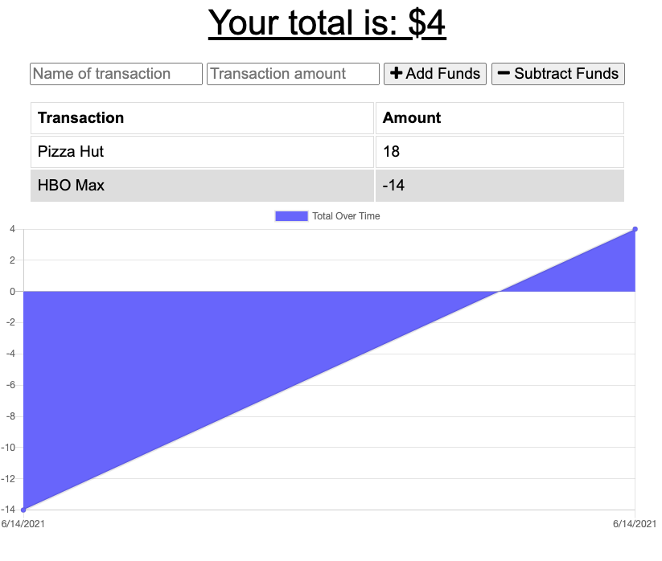

# Budget Tracker

## Description

The purpose of this application is to create a budget tracker that can be used both online and offline.

## Functionality

* User enters name of transaction, the amount, and clicks either the Add or Subtract funds button.

## NPM Packages
I used the following npm packages to build this application:
* express
* mongo
* morgan
* compression

## Live App

This app is deployed through Heroku [here](https://stark-sands-83989.herokuapp.com/).

